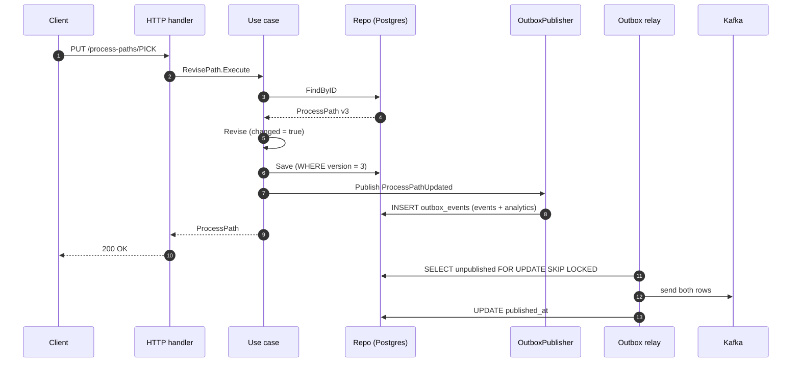

# Use cases

The application layer (`internal/application/usecases`) has seven use cases,
one struct each. Five are triggered only by REST; the three reads are also
exposed as MCP tools. There is no Kafka-triggered and no scheduled use case:
this service consumes no sibling topic, and its only background jobs (the
outbox relay and the housekeeping sweeper) are infrastructure in
`internal/adapters/outbound/postgres`, not use cases.

| Use case | Trigger | Writes | Event raised |
| --- | --- | --- | --- |
| `DefinePath` | REST `POST /process-paths` | `process_paths` (insert-only) | `ProcessPathCreated` |
| `RevisePath` | REST `PUT /process-paths/{pathId}` | `process_paths` (version-guarded) | `ProcessPathUpdated`, only if something changed |
| `DeactivatePath` | REST `DELETE /process-paths/{pathId}` | `process_paths` | `ProcessPathDeactivated`, only on the first deactivation |
| `GetPath` | REST `GET /process-paths/{pathId}`; MCP `get_process_path` | — | — |
| `ListPaths` | REST `GET /process-paths[?all=true]`; MCP `list_process_paths` | — | — |
| `DefineCPTSchedule` | REST `PUT /sites/{siteId}/cpt-schedule` | `cpt_schedules`, `cpt_schedule_cutoffs` | `CPTScheduleChanged`, only if the schedule is new or changed |
| `GetCPTSchedule` | REST `GET /sites/{siteId}/cpt-schedule`; MCP `get_cpt_schedule` | — | — |

Every write runs inside `UnitOfWork.Execute` when Postgres is configured, so
the aggregate row and the `outbox_events` rows commit together
([ADR 0003](../adr/0003-transactional-outbox.md)); with the in-memory
adapters the save and the publish simply run back to back. Event payloads
are on [Domain events](./domain-events.md); the problem types each error
maps to are on [Troubleshooting](../operations/troubleshooting.md).

## `DefinePath`

`internal/application/usecases/define_path.go`

**Inputs:** `pathId`, `matchPrefix`, `direct`, `requiredCapabilities[]`,
optional `destinationLocationRole`, `cycleTimeP95` (Go duration string),
optional `eligibility` (`maxUnitsPerLine`, `requiredProductAttributes`,
`excludedProductAttributes`, `nonSortable`). With Postgres, the HTTP route
also requires an `Idempotency-Key` header.

**Checks, in order:**

1. HTTP adapter: `destinationLocationRole` is empty or one of `Drop`,
   `WorkCenter`, `Shipping`; `cycleTimeP95` parses as a Go duration.
2. No path with this id exists, **active or deactivated**
   (`ErrPathAlreadyExists`). A deactivated id can never be reused.
3. `processpath.Define`: non-empty `pathId`, non-empty and lower-case
   `matchPrefix`, at least one capability, valid destination role,
   `cycleTimeP95 > 0`.
4. `Repo.Create` is insert-only: a concurrent define that wins the race
   makes this one fail with `ErrPathAlreadyExists` instead of overwriting.

**Raises:** `ProcessPathCreated` with the full definition.
**Metrics:** `process_path_management.paths.defined{outcome=accepted|rejected}`
(rejections at steps 2–4).

## `RevisePath`

`internal/application/usecases/revise_path.go`

**Inputs:** `pathId` (URL), `matchPrefix`, `requiredCapabilities[]`,
`cycleTimeP95`, optional `eligibility`. `direct` and
`destinationLocationRole` are not revisable.

**Checks:** the path exists (`ErrPathNotFound`); it is Active
(`ErrPathDeactivated`); the same field invariants as define. The save is
guarded by the row's `version` column; a concurrent writer makes it fail
with `ErrConcurrentModification`
([ADR 0017](../adr/0017-optimistic-concurrency-version-column.md)).

**Raises:** `ProcessPathUpdated` with the full new definition, only when
`matchPrefix`, capabilities, cycle time or eligibility actually changed. An
identical body returns 200 and publishes nothing.

## `DeactivatePath`

`internal/application/usecases/deactivate_path.go`

**Inputs:** `pathId` (URL).

**Checks:**

1. Unlocked pre-check: unknown → `ErrPathNotFound`; already deactivated →
   success, nothing published (idempotent).
2. Inside the unit of work the row is re-read `FOR UPDATE`, then
   `ListSiteIDsReferencingPath`: if any site's CPT schedule lists the path
   in a cutoff, fail with `ErrPathReferencedByCPTSchedule` naming the sites
   ([ADR 0026](../adr/0026-reject-deactivation-of-paths-in-cpt-schedules.md)).
   The row lock serialises this against `DefineCPTSchedule`
   ([ADR 0028](../adr/0028-close-path-cpt-schedule-race-with-row-locks.md)).

**Raises:** `ProcessPathDeactivated` (`path_id` only). Deactivation is
terminal: nothing reactivates a path.

## `GetPath` and `ListPaths`

`internal/application/usecases/queries.go`

- `GetPath(pathId)` returns the path in any status, or `ErrPathNotFound`.
- `ListPaths(activeOnly)` returns Active paths by default; `?all=true` (REST)
  or `activeOnly: false` (MCP) includes deactivated ones. The REST query
  value must be exactly `true` or `false`.

No invariants, no events.

## `DefineCPTSchedule`

`internal/application/usecases/cpt_schedule.go`

**Inputs:** `siteId` (URL), `timezone`, `cutoffs[]` each with `cptId`,
`localTime`, `daysOfWeek[]`, `shipMethod`, `eligiblePathIds[]`. Every `PUT`
replaces the whole schedule; there is no partial update.

**Checks, in order:**

1. HTTP adapter, per cutoff (`cptschedule.NewCutoff`): non-empty `cptId`;
   `localTime` exactly `HH:MM` 24-hour; at least one day, each `Mon`…`Sun`;
   non-empty `shipMethod`; at least one eligible path id.
2. Inside the unit of work: the distinct `eligiblePathIds` across all
   cutoffs are sorted and locked `FOR SHARE`; every one must be an existing
   **Active** path (`ErrIneligiblePathId`). This is the only cross-aggregate
   invariant, enforced here rather than by a foreign key
   ([ADR 0010](../adr/0010-fulfillment-capability-contract.md)).
3. `cptschedule.Define` (no schedule yet) or `Revise` (existing): non-empty,
   valid IANA `timezone`; at least one cutoff; `cptId` unique within the
   site.
4. The upsert is version-guarded (`ErrConcurrentModification`).

**Raises:** `CPTScheduleChanged` carrying the full schedule snapshot, when
the schedule is new or differs from the stored one. An identical `PUT`
returns 200 and publishes nothing.

## `GetCPTSchedule`

Returns the site's schedule or `ErrCPTScheduleNotFound`. No events.

## Outside the application layer: the analytics projection

The catalogue-growth read model is not built by a use case in
`internal/application`. `pathmgmt-projector` consumes this service's own
analytics topic (`internal/adapters/inbound/kafka/analytics_consumer.go`) and
applies each `ProcessPathCreated`/`Updated`/`Deactivated` to the
`report.ProjectionStore` port (`internal/analytics/report`), incrementing the
`paths_defined`/`paths_revised`/`paths_deactivated` counter of the event's
UTC day. It is idempotent per CloudEvents `id` and raises no events. The
reader side is `report.ReportStore`, served by `pathmgmt-reports`
([Runbook](../operations/runbook.md#reports-api-pathmgmt-reports)). See
[ADR 0007](../adr/0007-analytical-data-product.md).

## Sequence of a write

Source: `internal/application/usecases/revise_path.go`,
`internal/adapters/outbound/postgres/outbox_publisher.go`,
`internal/adapters/outbound/postgres/outbox_relay.go`.
Omits: the transaction boundary (steps 6 to 8 run in one `UnitOfWork`; the
read in step 3 does not), error paths, and the idempotency middleware (POST
only).
