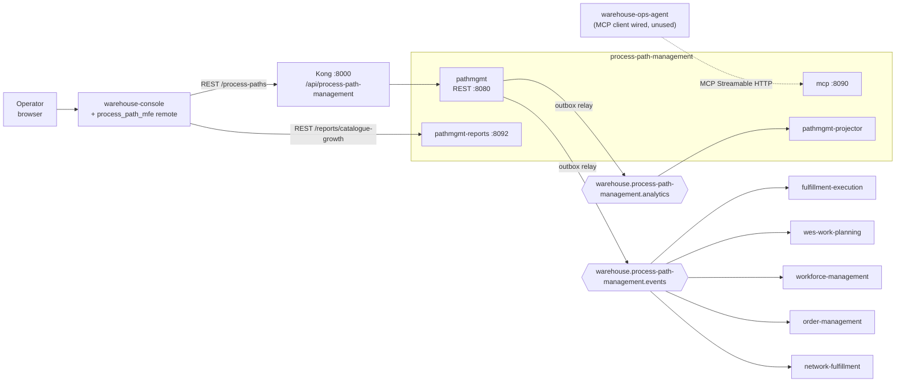

# Integration

Process Path Management is **upstream of everyone and downstream of no
one**. Its inputs are operator decisions made through its own REST API
(and nothing else); its outputs are Kafka events, a read-only MCP surface
and a report API. The DDD patterns for each edge are on the
[Context Map](./context-map.md); this page is the engineering view: what
travels on each edge and what happens when it fails.

## At a glance

Source: `cmd/pathmgmt/main.go`, `cmd/mcp/main.go`,
`internal/adapters/outbound/kafka/publisher.go`,
`internal/adapters/inbound/kafka/analytics_consumer.go`, `web/src/config.ts`;
consumer evidence as listed on the [Context Map](./context-map.md).
Omits: the analytical database and the Nginx gateway serving the remote's
assets.

## Inbound (who calls this service)

| Caller | Protocol | Contract | Failure behaviour |
| --- | --- | --- | --- |
| Operator through warehouse-console and this repo's `process_path_mfe` remote (`web/`) | REST over Kong, base `/api/process-path-management` (`web/src/config.ts`; `http://localhost:8087` in dev) | `GET /process-paths`, `POST /process-paths` (fresh `Idempotency-Key` per submit), `PUT /process-paths/{pathId}`, `DELETE /process-paths/{pathId}` — see the [API Reference](/docs/api-reference/rest/process-path-management-api) | Errors come back as RFC 7807 problem documents the remote shows to the operator. The remote has no CPT schedule screen: `PUT /sites/{siteId}/cpt-schedule` is called directly against the API. |
| warehouse-console context reports | REST to `pathmgmt-reports` | `GET /reports/catalogue-growth`, `GET /reports/catalogue-growth/freshness` ([Runbook](../operations/runbook.md#reports-api-pathmgmt-reports)) | 400 `invalid-report-query`, 500 `report-store-error`. Independent of the OLTP database. |
| warehouse-ops-agent | MCP Streamable HTTP to `cmd/mcp` (`/`, `/mcp`) | Tools `get_process_path`, `list_process_paths` (and `get_cpt_schedule`, `get_catalogue_growth_report`, which no sibling calls) — [MCP tools](../mcp/tools.md) | The agent's client is constructed but assigned to `_` in its `cmd/agent/main.go`; no use case calls it today. |
| Any sibling over Kafka | — | **None.** This service consumes no other context's topic. | — |

All inbound surfaces are unauthenticated
([ADR 0005](../adr/0005-remove-rest-auth.md)); CORS on the REST API allows
the origins in `CORS_ALLOWED_ORIGINS`.

## Outbound (what this service emits)

### `warehouse.process-path-management.events`

The integration topic, a Published Language consumed by five siblings.

| Event `type` | Raised by | `data` | Consumers |
| --- | --- | --- | --- |
| `com.warehouse.wes.process-path-management.processpath.ProcessPathCreated` | `DefinePath` | `path_id`, `match_prefix`, `direct`, `required_capabilities`, `destination_location_role` (omitted when unset), `cycle_time_p95` (Go duration string), `eligibility` | fulfillment-execution, wes-work-planning, workforce-management, order-management, network-fulfillment |
| `com.warehouse.wes.process-path-management.processpath.ProcessPathUpdated` | `RevisePath`, only when something changed | same full snapshot | same five |
| `com.warehouse.wes.process-path-management.processpath.ProcessPathDeactivated` | `DeactivatePath`, only on the first deactivation | `path_id` only | same five |
| `com.warehouse.wes.process-path-management.cptschedule.CPTScheduleChanged` | `DefineCPTSchedule`, only when the schedule changed | `site_id`, `timezone`, `cutoffs[]` (`cpt_id`, `local_time`, `days_of_week`, `ship_method`, `eligible_path_ids`) | order-management, network-fulfillment |

Envelope: CloudEvents 1.0, structured mode, `source`
`/warehouse/process-path-management`, `subject` and Kafka key = `PathId`
(or `SiteId`), `dataschema`
`urn:warehouse:process-path-management:events:<EventName>:v1`
([ADR 0016](../adr/0016-cloudevents-mandatory-event-envelope.md)). Headers:
`content-type: application/cloudevents+json; charset=UTF-8`, plus
`traceparent`/`tracestate` when the write ran inside a trace. Full schemas:
`apis/asyncapi.yaml` and [Domain events](../ddd/domain-events.md).

Every event is a **full snapshot** of the aggregate (except the
deactivation), so a consumer that replays the topic from offset 0 rebuilds
the whole catalogue. The three WES consumers do exactly that on boot.

**Failure behaviour.**

- *Broker down, cluster mode (Postgres + `EVENT_PUBLISHER=kafka`).* Writes
  keep succeeding: events are committed to `outbox_events` in the same
  transaction as the aggregate. The relay retries every second and drains
  the backlog in order when the broker returns. Consumers see the change
  late, never lost. Watch `process_path_management.outbox.lag_seconds`.
- *Broker down, no Postgres, `EVENT_PUBLISHER=kafka` (dev only).* The use
  case saves to memory and then the direct publish fails, so the request
  returns 500 while the in-memory change is kept. Store and topic diverge;
  this mode has no outbox.
- *`EVENT_PUBLISHER=log`.* Nothing reaches Kafka and nothing is queued for
  later.
- *Duplicates.* At-least-once: the same CloudEvents `id` can arrive twice.
  Consumers key their caches by `PathId`/`SiteId`, so a duplicate is an
  overwrite with the same data.
- *Ordering.* Per aggregate only: the relay sends in outbox-id order and the
  `Hash` balancer keeps one key on one partition
  ([ADR 0013](../adr/0013-kafka-writer-hash-balancer.md)). There is no
  ordering between different paths or between a path and a schedule.

### `warehouse.process-path-management.analytics`

Same four events, same `id`, `dataschema`
`urn:warehouse:process-path-management:analytics:<EventName>:v1`. Consumed
only by this service's `pathmgmt-projector` (group
`process-path-management-analytics`); poison messages go to
`warehouse.process-path-management.analytics.dlq`. Not a sibling contract
([ADR 0007](../adr/0007-analytical-data-product.md)).

## Deliberately absent edges

| Edge | Why absent | Enforced by |
| --- | --- | --- |
| REST or MCP calls from this service to any sibling | A Generic catalogue must not put its availability on, or depend on, a sibling's hot path ([ADR 0001](../adr/0001-process-path-management-bounded-context.md)) | `TestNoSiblingContextOutboundCalls` (`internal/architecture/fitness_test.go`) |
| Consuming any sibling topic | Same reason; the service is the source of its language | No inbound Kafka adapter other than the analytics consumer |
| Validating capability names against workforce-management | Capabilities are free strings declared by the operator | `internal/domain/shared` (`Capability`) |
| Validating `destinationLocationRole` / `siteId` against facility-layout | Separate Ways: `Drop`, `WorkCenter`, `Shipping` and site ids are local copies kept in sync by convention | `internal/domain/shared/shared.go` |
| Validating eligibility product attributes against product-master | Free strings (`hazmat`, `fragile`, ...); product-master's topic is not consumed | `internal/domain/shared/eligibility.go` |

Because the inputs are local and declarative, a typo in a capability, role
or attribute is accepted here and only shows up as a mismatch in the
consumer. Review the catalogue with `GET /process-paths?all=true`.
