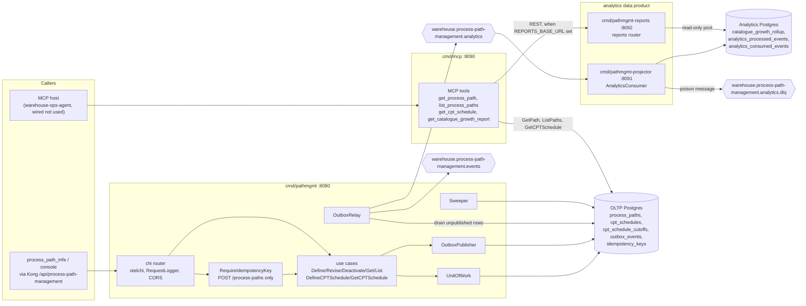

# Architecture

Process Path Management is a hexagonal (ports and adapters) Go service. The
dependency rule points inward only: **domain depends on nothing, application
depends on domain, adapters depend on application and domain**. The rule is
enforced by `internal/architecture/architecture_test.go` (arch-go, `make
arch-test`) and by the fitness tests in `internal/architecture/fitness_test.go`,
not by convention alone ([ADR 0021](../adr/0021-architecture-fitness-suite.md)).

## Package layout

| Path | Layer | What lives there |
| --- | --- | --- |
| `internal/domain/processpath` | Domain | `ProcessPath` aggregate: `Define`, `Revise`, `Deactivate`, `Rehydrate`, its invariant errors |
| `internal/domain/cptschedule` | Domain | `CPTSchedule` aggregate and `Cutoff` value object, `CPTScheduleChanged` event |
| `internal/domain/shared` | Domain | `PathId`, `Capability`, `SiteId`, `DestinationLocationRole`, `Eligibility`, the `ProcessPath*` domain events |
| `internal/application/ports` | Application | Outbound ports: `ProcessPathRepo`, `CPTScheduleRepo`, `EventPublisher`, `UnitOfWork`, `Clock`, `PathMetrics`, and `ErrConcurrentModification` / `ErrAlreadyExists` |
| `internal/application/usecases` | Application | `DefinePath`, `RevisePath`, `DeactivatePath`, `GetPath`, `ListPaths`, `DefineCPTSchedule`, `GetCPTSchedule` (see [Use cases](../ddd/use-cases.md)) |
| `internal/analytics/report` | Read model | Catalogue-growth report shapes and the `ReportStore` / `ProjectionStore` ports. Imports nothing else in the module ([ADR 0007](../adr/0007-analytical-data-product.md)) |
| `internal/adapters/inbound/http` | Inbound adapter | chi router, DTOs, RFC 7807 mapping, Idempotency-Key middleware, readiness gate, request logger, and the separate reports router |
| `internal/adapters/inbound/mcp` | Inbound adapter | MCP server and its read-only tools, plus the REST client for `pathmgmt-reports` |
| `internal/adapters/inbound/kafka` | Inbound adapter | The analytics consumer (this service's own analytics topic only) and its dead-letter writer |
| `internal/adapters/outbound/postgres` | Outbound adapter | pgxpool repos, `UnitOfWork`, `OutboxPublisher`, `OutboxRelay`, `Sweeper`, outbox lag gauge, golang-migrate runner |
| `internal/adapters/outbound/memory` | Outbound adapter | In-memory repos and the system clock, used when `DATABASE_URL` is unset and by tests |
| `internal/adapters/outbound/kafka` | Outbound adapter | Integration and analytics encoders/publishers, fan-out publisher, W3C trace-context headers, writer settings |
| `internal/adapters/outbound/events` | Outbound adapter | `LogPublisher`, the default publisher (`EVENT_PUBLISHER=log`) |
| `internal/adapters/outbound/analyticsstore` | Outbound adapter | Analytics projection (writer), report reader, consumed-events gate, analytics pools |
| `internal/adapters/outbound/telemetry` | Outbound adapter | OTel trace and metric providers, `PathMetrics` counter, trace-correlating slog handler |
| `internal/adapters/outbound/bootretry` | Outbound adapter | Bounded retry of the first Postgres dial at boot ([ADR 0024](../adr/0024-bootretry-for-istio-native-sidecar-warmup.md)) |
| `internal/adapters/kafka/cloudevents` | Shared adapter | The only place a CloudEvents 1.0 envelope is built or decoded ([ADR 0016](../adr/0016-cloudevents-mandatory-event-envelope.md)) |
| `internal/pgtx` | Shared adapter | Transaction-in-context slot shared by the idempotency middleware and the Postgres unit of work |
| `cmd/*` | Composition roots | One `main.go` per binary. Environment variables are read only here (plus `CORS_ALLOWED_ORIGINS` and `ENVIRONMENT`, see [Configuration](../operations/configuration.md)) |
| `migrations/`, `migrations/analytics/` | Schema | golang-migrate SQL for the OLTP and analytical databases |
| `web/` | Frontend | `process_path_mfe`, the operator Module Federation remote ([ADR 0022](../adr/0022-mfe-console-remote.md)) |

## Binaries

All four binaries are built into one image (`Dockerfile`, entrypoint
`./pathmgmt`); the chart picks the binary with `command:`.

| Binary | Role | Port (default env) | Endpoints | Helm workload |
| --- | --- | --- | --- | --- |
| `cmd/pathmgmt` | OLTP REST API. Also runs the outbox relay and the housekeeping sweeper in-process when Postgres is configured | `:8080` (`HTTP_ADDR`) | The 7 operations in `apis/openapi.yaml`, plus `GET /healthz` and `GET /readyz` | `<release>` Deployment (component `api`), Service port 80 → 8080 |
| `cmd/mcp` | Read-only MCP server over Streamable HTTP | `:8090` (`MCP_ADDR`) | MCP at `/`, `/mcp` and `/mcp/`; `GET /healthz` | `<release>-mcp` (only with `mcp.enabled=true`), Service port 8090 |
| `cmd/pathmgmt-projector` | Analytics writer: consumes `warehouse.process-path-management.analytics` into the analytical database. Owns the analytical schema | `:8091` (`ADMIN_ADDR`) | `GET /healthz`, `GET /readyz` only | `<release>-projector` (only with `analytics.enabled=true`), no Service |
| `cmd/pathmgmt-reports` | Analytics reader: serves the catalogue-growth report over a read-only pool | `:8092` (`HTTP_ADDR`) | `GET /reports/catalogue-growth`, `GET /reports/catalogue-growth/freshness`, `GET /healthz` | `<release>-reports` (only with `analytics.enabled=true`), Service port 80 → 8092 |

The reports and MCP routes are not in `apis/openapi.yaml`; they are described
in the [Runbook](../operations/runbook.md#reports-api-pathmgmt-reports) and
[MCP tools](../mcp/tools.md).

## Component diagram

Source: `cmd/pathmgmt/main.go`, `cmd/mcp/main.go`,
`cmd/pathmgmt-projector/main.go`, `cmd/pathmgmt-reports/main.go`,
`internal/adapters/inbound/http/server.go`,
`internal/adapters/outbound/postgres/outbox_publisher.go`,
`internal/adapters/outbound/postgres/outbox_relay.go`.
Omits: the log-publisher and in-memory modes, OTel export, the frontend pod
and the five sibling consumers of the integration topic.

## Delivery modes

`cmd/pathmgmt` picks its persistence and event publisher from two environment
variables (`buildPersistence` and `buildEventPublisher` in
`cmd/pathmgmt/main.go`):

| `DATABASE_URL` | `EVENT_PUBLISHER` | Repositories | Publisher | Outbox relay / sweeper |
| --- | --- | --- | --- | --- |
| unset | `log` (default) | in-memory | `LogPublisher` (one `domain event published` log line per event) | not started |
| unset | `kafka` | in-memory | `FanOutPublisher` writing directly to both topics under one shared CloudEvents `id` | not started |
| set | `log` | Postgres | `LogPublisher`, no outbox rows written | relay not started; sweeper runs |
| set | `kafka` | Postgres | `OutboxPublisher`: one `outbox_events` row per topic, in the same transaction as the aggregate write | relay and sweeper run in-process. **This is the cluster mode.** |

With Postgres configured the use cases wrap the aggregate write and the
publish in one `UnitOfWork` transaction, so the store and the topics cannot
diverge ([ADR 0003](../adr/0003-transactional-outbox.md)). In the
`DATABASE_URL` set + `EVENT_PUBLISHER=log` row, events are only logged:
nothing reaches Kafka, and nothing will be relayed later either.

`cmd/mcp` uses the same `DATABASE_URL` selection but never publishes (it
only wires the read use cases).

## Data stores

| Store | Used by | Schema owner | Tables | Pool |
| --- | --- | --- | --- | --- |
| OLTP Postgres (`DATABASE_URL`) | `pathmgmt`, `mcp` | Both binaries run `migrations/` at boot (idempotent) | `process_paths`, `cpt_schedules`, `cpt_schedule_cutoffs`, `outbox_events`, `idempotency_keys` | `MaxConns=10`, `statement_timeout=5s` per process (`internal/adapters/outbound/postgres/pool.go`) |
| Analytics Postgres (`ANALYTICS_DATABASE_URL`) | `pathmgmt-projector` (read-write), `pathmgmt-reports` (read-only) | `pathmgmt-projector` runs `migrations/analytics/` at boot | `catalogue_growth_rollup`, `analytics_processed_events`, `analytics_consumed_events` | projector `MaxConns=5`, `10s`; reports `MaxConns=5`, `15s`, `default_transaction_read_only=on` (`internal/adapters/outbound/analyticsstore/pool.go`) |
| Kafka (one fleet broker) | `pathmgmt` (producer), `pathmgmt-projector` (consumer) | — | Topics: `warehouse.process-path-management.events`, `warehouse.process-path-management.analytics`, `warehouse.process-path-management.analytics.dlq` | Writers use the `Hash` balancer, `RequireAll` acks, 10 ms batch timeout |

The full column-level schema is on [Entity relationship](../ddd/entity-relationship.md).

## Request path of a write

1. chi middleware: `RequestID`, `otelchi` span, `http.server.request.duration`
   histogram, `RequestLogger`, `Recoverer`, CORS.
2. `POST /process-paths` only, and only when Postgres is configured: the
   Idempotency-Key middleware opens a transaction, records the key and binds
   the transaction into the request context ([ADR 0011](../adr/0011-idempotency-key-middleware.md)).
3. The handler decodes the DTO and calls the use case.
4. The use case validates through the aggregate, then runs `Create`/`Save` and
   `Publish` inside `UnitOfWork.Execute`. A transaction already in the context
   (from step 2) is joined, not nested.
5. `OutboxPublisher` inserts one row per topic with the request's
   `traceparent`/`tracestate` ([ADR 0027](../adr/0027-w3c-trace-context-on-kafka-headers.md)).
6. Commit. The relay picks the rows up on its next pass (1 s idle interval by
   default) and marks them published after the broker acknowledges.

The [Sequence diagrams](../ddd/sequence-diagrams.md) page has the per-use-case
detail.
