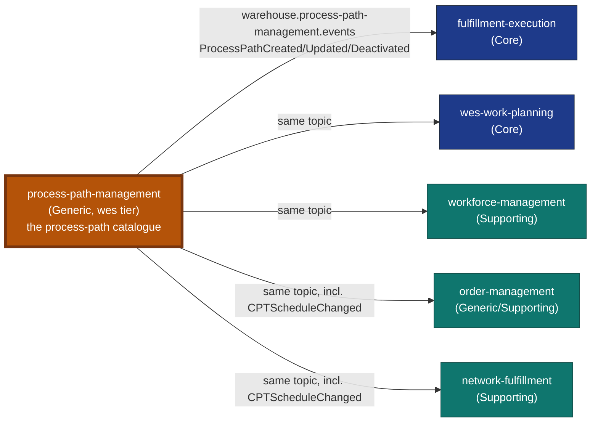

# Process Path Management

:::warning[Study project]
This documentation site is an educational Domain-Driven Design exercise. It
follows real industry-standard patterns and terminology, but it is **not a
production system** and is **not affiliated with, endorsed by, or
representative of any real-world
company**.
:::

**Process Path Management** is the fleet's operator-configurable process-path
catalogue. It is one of the fifteen domain contexts of the `warehouse-systems`
fleet, a Go service in the **WES tier**: every CloudEvents `type` it publishes
starts with `com.warehouse.wes.process-path-management.`
(`internal/adapters/kafka/cloudevents/cloudevents.go`, `Subdomain = "wes"`).

| | |
| --- | --- |
| **Subdomain class** | Generic (see [Subdomain classification](../ddd/subdomain-classification.md)) |
| **Tier** | `wes` (execution tier) |
| **Role in the fleet** | Open Host Service / Published Language **source** of `warehouse.process-path-management.events` |
| **Outbound calls to siblings** | None. No REST, no MCP, no foreign topic (enforced by `TestNoSiblingContextOutboundCalls`) |
| **Binaries** | `pathmgmt`, `mcp`, `pathmgmt-projector`, `pathmgmt-reports` |
| **Auth** | None. REST and MCP are unauthenticated fleet-wide ([ADR 0005](../adr/0005-remove-rest-auth.md)) |

## Why this context exists

Before this service existed, the process-path definition lived in a static
YAML file, `warehouse-infra/config/process-paths/sortable-fc.yaml`, loaded
once at boot by `fulfillment-execution`, `wes-work-planning` and
`workforce-management`. That definition is a path's canonical identity, the
`matchPrefix` rule consumers use to resolve a caller-supplied id to a path
family, and the capabilities a station or associate must hold to work it. A
boot-time file cannot change without redeploying every consumer, has no audit
trail and has no owner. This service replaces it with a bounded context: two
aggregates, a REST API to define, revise and deactivate them, and a
Kafka-published integration event so a change reaches consumers without a
synchronous call into any of them.

See [ADR 0001](../adr/0001-process-path-management-bounded-context.md) for
the decision, including why propagation is Kafka-driven rather than a
synchronous HTTP read-through.

## What it owns

| Capability | What that means here |
| --- | --- |
| **ProcessPath** | The aggregate root: `PathId` (identity), `MatchPrefix`, `Direct`, `RequiredCapabilities`, optional `DestinationLocationRole` ([ADR 0009](../adr/0009-destination-location-role-on-process-path.md)), `CycleTimeP95` and `Eligibility` ([ADR 0010](../adr/0010-fulfillment-capability-contract.md)), `Status` (`ACTIVE`/`DEACTIVATED`). |
| **Define / Revise / Deactivate** | The lifecycle of a path definition. Each change publishes its own domain event; a no-op revision publishes nothing. |
| **List / Get** | Reads for the operator SPA's default view (active only) and audit view (`?all=true`). |
| **CPTSchedule** | A second aggregate, one per site: its IANA timezone and recurring Critical Pull Time cutoffs, each naming the Active paths that can make it. Defined or wholesale-revised by `PUT /sites/{siteId}/cpt-schedule`; publishes `CPTScheduleChanged` ([ADR 0010](../adr/0010-fulfillment-capability-contract.md)). |
| **Catalogue growth report** | An analytical read model (paths defined, revised and deactivated per UTC day) built by `pathmgmt-projector` from this service's own analytics topic and served by `pathmgmt-reports` ([ADR 0007](../adr/0007-analytical-data-product.md)). |

Four binaries ship from `cmd/`: `pathmgmt` (REST API on `:8080`, plus the
in-process outbox relay and housekeeping sweeper), `mcp` (read-only MCP
server on `:8090`, [ADR 0006](../adr/0006-mcp-server-second-inbound-adapter.md)),
`pathmgmt-projector` (analytics writer, admin port `:8091`) and
`pathmgmt-reports` (read-only report API on `:8092`). The
[Architecture](./architecture.md) page shows how they fit together.

## What it deliberately does not own

- **Dispatch, routing or task assignment.** This service defines WHAT a path
  is and WHICH capabilities it requires. It never claims, assigns or completes
  work; that is `fulfillment-execution`'s job.
- **Any call to another context.** Every change propagates through Kafka
  (`warehouse.process-path-management.events`). There is no REST or MCP
  client to a sibling in this codebase, and an architecture fitness test keeps
  it that way. Siblings may read this service (the console over REST; the ops
  agent has an MCP client wired but no use case calls it). It never reads them.
- **Other contexts' vocabularies.** Capability names, product attributes, site
  ids and destination location roles are stored as declared values and never
  looked up live.

## How it fits the fleet

Source: `internal/adapters/outbound/kafka/publisher.go` (topic and payloads),
`internal/adapters/kafka/cloudevents/types.go` (event types); consumer list
from [Context Map](../ecosystem/context-map.md); classifications copied from
warehouse-docs `docs/strategic-design/subdomain-classification.md`.
Omits: the MCP, console and analytics edges (see
[Integration](../ecosystem/integration.md)).

All five consumers are live. The three WES-tier services replaced their
static YAML catalogue with this topic on 2026-09-06
([ADR 0002](../adr/0002-yaml-to-kafka-cutover.md)); `order-management` and
`network-fulfillment` read path capability and CPT schedules from it
([ADR 0010](../adr/0010-fulfillment-capability-contract.md)).

## Where to go next

| If you want to... | Read |
| --- | --- |
| See the hexagonal layout, binaries, ports and data stores | [Architecture](./architecture.md) |
| Run it on your laptop and make the first calls | [Quickstart](./quickstart.md) |
| Configure a binary | [Configuration](../operations/configuration.md) |
| Deploy, migrate, replay or scale it | [Runbook](../operations/runbook.md) |
| Find a metric, span or log field | [Observability](../operations/observability.md) |
| Diagnose a failure | [Troubleshooting](../operations/troubleshooting.md) |
| Run or extend the tests | [Testing](../development/testing.md) |
| Know who consumes what | [Integration](../ecosystem/integration.md) and [Context Map](../ecosystem/context-map.md) |
| Read every use case | [Use cases](../ddd/use-cases.md) |
| Use the MCP server | [MCP tools](../mcp/tools.md) and the [Governance charter](../mcp/governance-charter.md) |
| Learn the vocabulary and invariants | [Ubiquitous language](../ddd/ubiquitous-language.md), [Aggregates and invariants](../ddd/aggregates-and-invariants.md), the [DDD artifact pack](../ddd/ddd-artifacts.md) |
| Read the REST contract | [API Reference](/docs/api-reference/rest/process-path-management-api) (generated from `apis/openapi.yaml`) |
| Understand a past decision | [ADRs](../adr/about.md) |
